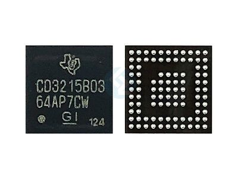

# Introduction



After our team successfully ported the checkm8 exploit to the AppleSilicon T2 chip, we began exploring methods for
closed-case hardware debugging, or CCD, as found on other iDevices. On such devices, the Serial Wire Debug protocol
can be muxed out across the Lightning connector, which we presumed was replicable across the USB Type-C connector.
With some assistance from easily obtainable schematics for our MacBook models, we have determined that muxing
is handled by an Apple/TI co-designed USB Type-C Port Controller, colloquially known as "ACE". The following details
our findings and the vendor defined protocol, termed AppleVDM, Apple has implemented over the USB Power Delivery
standard for muxing out various internal peripherals.

A member of our team, @h0m3us3r has dumped the ACE firmware by attaching a SWD probe onto exposed test points on
the logic board of a MacBook Pro. Thanks to this we were able to obtain both the ROM and the firmware payload patch
applied over it and discover that the ACE chip contains a Cortex-M0 r0p1 ARM core. Most of the static analysis was
later conducted by @mrarm.

```text
Connecting to target via SWD
Found SW-DP with ID 0x0BC11477
DPIDR: 0x0BC11477
Scanning AP map to find all available APs
AP[1]: Stopped AP scan as end of AP map has been reached
AP[0]: AHB-AP (IDR: 0x04770031)
Iterating through AP map to find AHB-AP to use
AP[0]: Core found
AP[0]: AHB-AP ROM base: 0xE00FF000
CPUID register: 0x410CC601. Implementer code: 0x41 (ARM)
Found Cortex-M0 r0p1, Little endian.
FPUnit: 4 code (BP) slots and 0 literal slots
CoreSight components:
ROMTbl[0] @ E00FF000
ROMTbl[0][0]: E000E000, CID: B105E00D, PID: 000BB008 SCS
ROMTbl[0][1]: E0001000, CID: B105E00D, PID: 000BB00A DWT
ROMTbl[0][2]: E0002000, CID: B105E00D, PID: 000BB00B FPB
Cortex-M0 identified.
```

## ACE Overview

To better understand the inner-workings of ACE, we began looking for identifying information within the dumped
firmware. We found the string `CD3217   HW0022 FW002.032.00 ZACE2-J213` and upon searching CD3217 online resulted
in the similar [TI TPS65986](https://www.ti.com/lit/ds/symlink/tps65986.pdf). Based on how similar the functional
description of the aforementioned TI USB Type-C Controller is to ACE, and considering that TI co-designed ACE
with Apple, it was reasonable to assume most of the technical information applies to ACE.

TI's USB Type-C Controllers expose an I²C interface for host management, for which we found the excellent Host
[Interface Technical Reference Manual](https://www.ti.com/lit/ug/slvuan1a/slvuan1a.pdf), documenting a multitude
of public I²C registers and commands.


The primary component of focus based on the above block diagram is the digital core, which communicates directly
with the host and runs the firmware we dumped previously. As mentioned, the core is based on a Cortex-M0 r0p1.
Unfortunately, we were unable to create a complete memory map with peripherals as TI does not release public
information on the core itself. Regardless, we have the basic memory layout as follows:

Since we weren't sure whether the code for muxing out things lives in the ACE or somewhere else (there are
registers for receiving vendor messages and processing them on another chip), we also investigated the firmware
of chips that can directly communicate with the ACE, the SMC, part of T2 SoC, and the Thunderbolt controller. While
we obtained and analyzed the I2C usages in the SMC firmware and found no suspicious code whatsoever, we had issues
with analyzing the Thunderbolt controller firmware and decided to only reverse engineer it as a last resort. We
initially thought that the only way that we could talk with the ACE from Mac OS (Intel) was by modifying the SMC
firmware to relay commands to the ACE. While we have successfully managed to edit the SMC firmware and talk with
the ACE, it turned out that this effort wasn't needed. Later we stumbled upon the following project:
[osy/ThunderboltPatcher](https://github.com/osy/ThunderboltPatcher), which uses the AppleHPM kext in order
to communicate with the ACE.

The `AppleHPM` KEXT allows a user space program running as root to read and write ACE registers. It also has
several interesting methods that seem to be intended for reading and writing registers on ACEs connected using
a USB Type-C cable to the DUT. Unfortunately, while we tried invoking them, we didn't manage to get these
methods working, suggesting that either they have been disabled on production hardware or need some more preparation
work in order to work. We also discovered that there exists an EFI mode firmware updater for the ACE called
`HPMUtil.efi`, which we also partially reverse engineered. There seems to be several methods of updating the
ACEs depending on the hardware revision; the EFI program also seems to have an argument that makes it update
externally connected ACEs, however at least for recent ACEs it seems to be broken; the only update route that
would work on the firmware dump we obtained from our Mac (based on available commands) seems to be hardcoded in
a few places to run commands on the local ACE.

There are at least 3 known revisions of the ACE chip. Based on hardware available to us, the first variant,
ACE1, is known to be used in 2018 and older T2 models, the second, ACE2, in 2019 and newer T2 models, and
the third in 2020 M1 enabled laptops. The software update method differs significantly between ACE1 and ACE2.
At the time of writing the article, we have only successfully dumped a single ACE firmware (ACE2) and all the
analysis here is based on that version.

## USB PD

The logical channel for telling the Mac to mux out something other than USB from the chip would be USB PD, since
ACE's main communication vector with external devices is USB PD and because controlling data lines using USB PD
is a widespread practice (see: MIPI debug interface as well as this article on getting UART off an Samsung
phone: <https://ntnuopen.ntnu.no/ntnu-xmlui/bitstream/handle/11250/2632162/bookchapter.pdf>). This TI-derived
controller can be configured to support some variant of MIPI debug mode by default (and the MIPI debug ID is
present in the Apple ACE firmware as well), however as we discovered later it is disabled in Apple's configuration
and can not be used. As such, we decided to look for other Vendor Defined Messages that the ACE understands.

In the USB PD protocol, entering a vendor mode begins by sending a SVID (Standard ID or Vendor ID, usually
the vendor's USB VID) and object position (think of it as a sub mode that the vendor can define). By analyzing the
ACE firmware we found at least 3 possible object positions under the Apple SVID, however their availability is
dynamic and by default only a single SVID and object position is available. This primary mode is, for example,
used when the Apple's charger is connected. We are not sure when the other modes are activated and plan to do
further work related to figuring out what the purpose of these other modes is.

Since it would be logical if there was a reply for the command for entering a mode and also because reverse
ngineering an embedded firmware with no context whatsoever is hard, we decided to look into the VDMs command,
which can be used to send a VDM PD message. This allowed us to gather important information about the firmware's
inner workings and also to find a few functions that sent a message with Apple's vendor ID. We investigated
several of these, some of them were indeed related to the protocol used with the charger (which we aren't sure
what the purpose of is; however from what it seems it can be only used to read some memory sections from the
external device), but we also found another procedure that had three cases, two of which replied with 16-bit
values (created from information from a particular memory area) in a similar way to the Discover SVIDs VDM,
and one of them was complex and handled additional logic. We investigated it further and eventually managed to
use it to mux things out of the controller.

Another possible use of the VDMs command can be found in the `AppleHPM` KEXT and the `HPLUtil.efi` program,
which is reading registers from externally connected devices. Since we haven't given much attention to it
as it was not our goal and our experiments were a failure, we are not going to describe it in this article.

Note that since SWD can also be muxed from the ACE, further reverse engineering ACE modes is not that
interesting; you should be able to use the ACE's SWD to trigger any mux choice of your choosing and directly
talk to all peripherals ACE has access to.

## Dive into the code

With @h0m3us3r's dump of ROM and RAM memory, we started by loading the ACE firmware in IDA. The reset handler
address is present at `0x00000004` and can be used to get the address of the entrypoint.

The command table can be trivially found by looking for the 4 character codes. Register table requires a bit
more effort but is also not hard to find (since there is a register that is a string, you can find what
references it). In comparison to the public TI documentation, there are substantially more commands and
registers available, some of which are Apple-specific additions. Since the firmware has barely any strings
or debug information, the command list has been very helpful.

After initially exploring the firmware we quickly stumbled upon cursed looking trampolines such as the following:

```assembly
ROM:000266C2 _Command_HRST                           ; DATA XREF: ROM:commands↓o
ROM:000266C2
ROM:000266C2
ROM:000266C2                 PUSH            {R4-R6,LR}
ROM:000266C4                 MOV             R4, R1
ROM:000266C6                 MOV             R5, R0
ROM:000266C8                 BL              sub_E4
ROM:000266CC                 LDR             R0, =dword_20041040
ROM:000266CE                 MOV             R1, R4
ROM:000266D0                 ADDS            R0, #0x40 ; '@'
ROM:000266D2                 LDR             R2, [R0]
ROM:000266D4                 MOV             R0, R5
ROM:000266D6                 BLX             R2
ROM:000266D8                 MOV             R4, R0
ROM:000266DA                 BL              sub_E8
ROM:000266DE                 MOV             R0, R4
ROM:000266E0                 B               loc_260E2
ROM:000266E0 ; End of function _Command_HRST
```

Since IDA seems not to handle them nicely, we wrote a simple script to comment the BLX call. Unfortunately,
this does not play nicely with the IDA decompiler but was enough for further firmware research. The purpose
of these trampolines is to allow selective patching of functions in the firmware, since the main firmware
seems to reside in ROM.

After analyzing the VDMs (VDM send) command handler, we quickly found the function responsible for sending
arbitrary PD messages. From here, we looked at the list functions referencing it, finding a few interesting
possible investigation candidates, one of which turned out to be the one we were looking for. In addition,
it was called by a function that checked whether the `SOP` it originated from is `SOP'DBG` or `SOP''DBG`.


The function named `AppleVDM_0x12` in this image is in particular interesting as it is also referenced by
DVEn command. Unfortunately, with only 4 characters we were unable to derive the function from the name
alone. We decided to analyze all of these function called by this function starting from 0x10.

```c
unsigned char AppleVDM_0x10_StartNo, AppleVDM_0x10_NextStartNo, AppleVDM_0x10_IterA, AppleVDM_0x10_IterB;
unsigned char AppleVDM_Data[];
unsigned short AppleVDM_Type1_0x10_Values[];

void __fastcall AppleVDM_0x10(int sop)
{
  // Prepare the reply VDM
  SendMessageDataAfterHeader[0] = ((byte_20044394 << 13) + 0x50) | 0x5AC8000;

  if ( !AppleVDM_0x10_StartNo )
    AppleVDM_0x10_StartIter();
  unsigned char i = 1;
  int j = AppleVDM_0x10_StartNo;
  bool even = true;
  while ( i != 7 )
  {
    unsigned int value = AppleVDM_0x10_GetValue(j);
    AppleVDM_0x10_NextIter(&j);
    if ( even )
      SendMessageDataAfterHeader[i] = 0;
    if ( !value && ( !AppleVDM_0x10_IterA || AppleVDM_0x10_IterB == 8 ) )
      break;
    if ( !value && AppleVDM_0x10_IterB < 8 )
      continue;

    SendMessageDataAfterHeader[i] |= value << ( even ? 16 : 0 );
    if ( !even )
      ++i;
    even = !even;
    AppleVDM_0x10_NextStartNo = j;
  }

  if ( i != 7 ) {
    AppleVDM_0x10_NextStartNo = 0;
    AppleVDM_0x10_StartIter();
    ++i;
  }

  AppleVDM_0x10_ReplyMsgId = NextSendMessageId[sop];
  SendMessage(sop, 15, i);
}

void AppleVDM_0x10_StartIter() {
  AppleVDM_0x10_IterA = 0;
  AppleVDM_0x10_IterB = 0;
}

bool AppleVDM_0x10_NextIter(int *i)
{
  while ( *i < 0x40 )
  {
    // the d variable is composed of two parts - the end position (bits 0:5) and the entry type (bits 6:7)
    unsigned char d = AppleVDM_Data[*i];
    if ( ( d >> 6 ) == 1 && AppleVDM_0x10_IterB < 8 )
    {
      ++AppleVDM_0x10_IterB;
      return 0;
    }

    // endpos is the position where this data entry ends (relative to the start of the AppleVDM_Data blob)
    int endpos = d & 0x3F;
    if ( !endpos || endpos == 0x3F )
      return true;
    *i = endpos + 1;

    // if the type is not zero, return this index, otherwise skip
    if ( ( AppleVDM_Data[*i] >> 6 ) != 0 )
      return false;
  }
  return true;
}

unsigned int AppleVDM_0x10_GetValue(int i)
{
  if ( i + 4 >= 0x40 )
  return 0;

  int type = AppleVDM_Data[i] >> 6;
  switch (type) {
  case 1:
    AppleVDM_0x10_IterA = 1;
    if ( (AppleVDM_0x10_IterB || !sub_27B30()) && AppleVDM_Data[i + 1] & (1 << AppleVDM_0x10_IterB) )
      return AppleVDM_Type1_0x10_Values[AppleVDM_0x10_IterB];
  case 2:
    return 0x100 + AppleVDM_Data[i + 1];
  case 3:
    return (AppleVDM_Data[i + 1] << 8) | AppleVDM_Data[i + 2];
  }
  return 0;
}
```

This AppleVDM_0x10 function handles the 0x10 message. This function iterates over a list of possible
Actions, and presents them in a format similar to the one in Discover SVIDs (shorts followed by a 0
terminator).

This function wasn't perhaps particularly interesting on it's own but it was pretty easy to get a
rough idea of most of what is happening in general and was pretty stand-alone (other than the type
perhaps which was cross validated later).

Continuing to `0x11`:

```c
unsigned char AppleVDM_0x11_StartNo, AppleVDM_0x11_NextStartNo;
unsigned short AppleVDM_0x11_LastArgVal;
int Apple_0x11_ArgValIdx;
unsigned short AppleVDM_Type1_0x11_Values[];

void __fastcall AppleVDM_0x11(int sop, unsigned int *data)
{
  unsigned int argVal = data[1] & 0xffff;
  if ( argVal != AppleVDM_0x11_LastArgVal )
  {
    AppleVDM_0x11_LastArgVal = argVal;
    AppleVDM_0x11_StartNo = 0;
    AppleVDM_0x11_NextStartNo = 0;
  }
  AppleVDM_0x10_StartIter();
  Apple_0x11_ArgValIdx = AppleVDM_0x10_FindValue(argVal);
  if ( Apple_0x11_ArgValIdx == -1 )
  {
    SendMessageDataAfterHeader[0] = ((byte_20044394 << 13) + 0x91) | 0x5AC8000;
    SendMessage(sop, 15, 1);
    return;
  }

  SendMessageDataAfterHeader[0] = ((byte_20044394 << 13) + 0x51) | 0x5AC8000;
  unsigned char i = 1;
  int j = (unsigned __int8)AppleVDM_0x11_StartNo;
  bool even = true;
  while ( i != 7 )
  {
    if ( even )
      SendMessageDataAfterHeader[i] = 0;
    unsigned int data = AppleVDM_0x11_GetReplyData(Apple_0x11_ArgValIdx, j++);
    SendMessageDataAfterHeader[i] |= data << (even ? 0x10 : 0);
    AppleVDM_0x11_NextStartNo = j;
    if ( !even )
      ++i;
    even = !even;
    if ( !data )
      break;
  }
  if ( i != 7 ) {
    AppleVDM_0x11_NextStartNo = 0;
    AppleVDM_0x10_StartIter();
  }
  if ( j & 1 )
  {
    SendMessageDataAfterHeader[++i] = 0;
  }
  AppleVDM_0x11_ReplyMsgId = NextSendMessageId[sop];
  SendMessage(sop, 15, i);
}

int __fastcall AppleVDM_0x11_GetReplyData(int argIndex, int num)
{
  if ( argIndex == -2 )
    return AppleVDM_0x11_GetReplyData_Type1(argIndex, num);

  unsigned int endposAndType = AppleVDM_Data[argIndex];
  unsigned int endpos = endposAndType & 0x3F;
  if ( !endpos )
    return 0;
  unsigned int type = endposAndType >> 6;
  if (type == 2)
  {
    int j = argIndex + 2;
    if ( j > endpos )
      return 0;
    for ( int i = 0; i != num; ++i )
    {
      if ( j > endpos )
        return 0;
      j += 3;
    }
    return (AppleVDM_Data[j] << 8) | AppleVDM_Data[j + 1];
  }
  else if (type == 3)
  {
    int idx_b5_6, idx_remaining, idx_b1, idx_221;
    unsigned int t = ~AppleVDM_Data[j + 3];
    AppleVDM_0x11_GetReplyIndexes_Type3(((t >> 6) & 1) == 0, ((t >> 5) & 1) == 0, &idx_b5_6, &idx_remaining, &idx_b1, &idx_221);
    if ( idx_b1 == num )
      return 0x100 + AppleVDM_Data[j + 4];
    if ( idx_221 == num )
      return 0x221;
    unsigned int j = num == idx_b5_6 ? (argIndex + 5) : (argIndex + 7 + 2 * (num - idx_remaining));
    if (j + 1 <= endpos)
      return (AppleVDM_Data[j] << 8) | AppleVDM_Data[j + 1];
  }
  return 0;
}

unsigned int AppleVDM_0x11_GetReplyData_Type1(int argIndex, int num)
{
  if ( a2 < 8 )
  result = AppleVDM_Type1_0x11_Values[8 * AppleVDM_0x10_IterB + num];
  return 0;
}

void AppleVDM_0x11_GetReplyIndexes_Type3(int a1, int a2, int *idx_b5_6, int *idx_remaining, int *idx_b1, int *idx_221)
{
  if ( a1 )
  {
    *idx_b5_6 = 0;
    *idx_b1 = 1;
    if ( a2 )
    {
      *idx_221 = 2;
      *idx_remaining = 3;
      return;
    }
    *idx_remaining = 2;
    *idx_221 = -1;
  }
  else
  {
    *idx_b1 = 0;
    if ( a2 )
    {
      *idx_221 = 1;
      *idx_b5_6 = 2;
      *idx_remaining = 3;
      return;
    }
    *idx_b5_6 = 1;
    *idx_remaining = 2;
    *idx_221 = -1;
  }
}

unsigned int AppleVDM_0x10_FindValue(int value)
{
  int i = 0;

  AppleVDM_0x10_StartIter();
  while ( AppleVDM_0x10_GetValue(i) != value )
  {
    if ( AppleVDM_0x10_NextIter(&i) )
    return -1;
  }
  if ( AppleVDM_0x10_IterA )
    return -2;
  else
    return i;
}
```

This seems to list some additional information for each argument (list of these can be obtained
from the 0x10 VDM). Right now there is nothing we can say about these but for Type 2 the
information will become clear once we analyze some basic information about 0x12. Note that due
to the complexity, 0x12 was not fully analyzed and some aspects of it were skipped and instead
experimented with.

```c
bool __fastcall AppleVDM_0x12(int sop, unsigned int *data, unsigned int dataCount, int internalNonVDM)
{
  int replyVdoCount = 0;
  if ( !internalNonVDM )
  {
    SendMessageDataAfterHeader[0] = ((byte_20044394 << 13) + 0x52) | 0x5AC8000;
    replyVdoCount = 1;
  }
  unsigned int argVal = data[1] & 0xffff;
  unsigned char argLines = (data[1] >> 16) & 0x7F;
  bool argTryToExitPrevious = ((data[1] >> (16 + 7)) & 1) != 0;
  bool argPersistThroughReset = ((data[1] >> 24) & 1) != 0;
  bool argExit = ((data[1] >> 24) & 2) != 0;
  if ( !argVal )
  {
    if ( argTryToExitPrevious )
      DisableConflictingMuxModes(argLines);
    goto succcess;
  }

  bool hasNoCollidingModes = true;
  for ( int i = 0; i < 7; i++)
  {
    if ( (1 << i) & argLines && LineModeInfo[i].type >= 2u )
    hasNoCollidingModes = false; // has active colliding mode we should exit first
  }

  if ( !hasNoCollidingModes && argTryToExitPrevious ) {
    // note: this method sends a reply if it fails - 0x5AC80D2 if it exits an altmode
    // and you need to wait or 0x5AC8092 if it fails
    TryToExitCollidingModes(sop, argLines, replyVdoCount, &hasNoCollidingModes);
  }

  if ( !hasNoCollidingModes && argTryToExitPrevious )
    return false;

  if ( !argTryToExitPrevious && !hasNoCollidingModes )
  {
    if ( !internalNonVDM )
    {
      SendMessageDataAfterHeader[0] = ((byte_20044394 << 13) + 0x92) | 0x5AC8000;
      SendMessage(sop_, 15, replyVdoCount);
    }
    return false;
  }

  unsigned short args[10];
  memset(args, 0, 20);
  int j = 0;
  for ( int i = 2; i < dataCount; ++i )
  {
    args[j++] = data[i] >> 16;
    args[j++] = data[i];
  }
  if ( !AppleVDM_0x12_Perform(argValue, !argExit, argLines, argPersistThroughReset, args) )
  {
    if ( !internalNonVDM )
    {
      SendMessageDataAfterHeader[0] = ((byte_20044394 << 13) + 0x92) | 0x5AC8000;
      SendMessage(sop_, 15, replyVdoCount);
    }
    return false;
  }

succcess:
  AppleVDM_0x12_CollectStateForReply((int)&AppleVDM_0x12_CurrentStateForReply);
  if ( !internalNonVDM )
  {
    AppleVDM_0x12_SOPForReply = sop;
    ScheduleWork(14, 52, AppleVDM_0x12_SendSuccessWithCurrentState);
  }
  sub_25B66(56);
  return true;
}

int __fastcall AppleVDM_0x12_CollectStateForReply(unsigned int *data)
{
  unsigned short *sdata = (unsigned short *) data;
  sdata[1] = 0;
  sdata[0] = GetCurrentActiveModeInfo(0, &type[0]);
  sdata[3] = GetCurrentActiveModeInfo(1, &type[1]);
  sdata[2] = GetCurrentActiveModeInfo(2, &type[2]);
  sdata[5] = GetCurrentActiveModeInfo(3, &type[3]);
  sdata[4] = GetCurrentActiveModeInfo(4, &type[4]);
  sdata[7] = GetCurrentActiveModeInfo(5, &type[5]);
  sdata[6] = GetCurrentActiveModeInfo(6, &type[6]);

  unsigned int connState = SystemStatus.ConnState;
  if ( connState == 2 || connState == 3 ) // Audio connection (Ra/Ra), Debug connection (Rd/Rd)
  {
    v4 = 3;
  }
  else if ( connState == 6 || connState == 7 ) // Connection present
  {
    if ( IsPlugUpsideUp() )
      v4 = 1;
    else
      v4 = 2;
  }
  else // No connection
  {
    v4 = 0;
  }
  data[0] |= (type[0] << 16) | (type[1] << 18) | (type[2] << 20) | (type[3] << 22) |
             (type[4] << 24) | (type[5] << 26) | (type[6] << 28) | (v4 << 30);
}

void AppleVDM_0x12_SendSuccessWithCurrentState()
{
  SendMessageDataAfterHeader[0] = ((byte_20044394 << 13) + 0x52) | 0x5AC8000;
  memcpy(&SendMessageDataAfterHeader[1], &AppleVDM_0x12_CurrentStateForReply, 16);
  SendMessage(AppleVDM_0x12_SOPForReply, 15, 5);
}

bool AppleVDM_0x12_Perform(int argValue, bool activate, int targetLines, bool persistThroughReset, unsigned short *args)
{
  int argIndex = AppleVDM_0x10_FindValue(argValue);
  if ( argIndex == -1 )
    return false;
  int type;
  if ( argIndex == -2 )
  {
    if (AppleVDM_0x10_IterB >= 7u )
      type = 2;
    else
      type = 3;
  }
  else
  {
    type = AppleVDM_Data[argIndex] >> 6;
  }
  if ( type == 2 )
  {
    if ( !args )
      return false;

    unsigned char extraVal;
    bool result = AppleVDM_0x12_Find_Type2_ExtraValue(valNo, args[0], &extraVal);
    if ( result )
      result = AppleVDM_0x12_Perform_Type2(extraVal);
    return result;
  }
  else if (type == 3)
  {
    if ( valNo == -2 )
      v10 = AppleVDM_Type1_0x12_Values[AppleVDM_0x10_IterB];
    else
      v10 = AppleVDM_Data[argIndex + 3] & 0x1F;
    return AppleVDM_0x12_Perform_Type3(v10, targetLines, activate, argValue, flag1, args);
  }
  return 0;
}

int AppleVDM_0x12_Perform_Type2(int internalId)
{
  if ( internalId == 0 )
    Command_GAID_Gaid(0);
  if ( internalId == 1 || internalId == 2 ) {
    if ( internalId == 2 ) {
      if ( FindGPIOBit(10) != 0xFF )
        GPIOAction(10, 4);
      MEMORY[0x4009004C] &= 0xFEFFFFFF;
      if ( RegAppleVIDConfig[5] & 0x20 )
        sub_28B22();
    }
    GPIOAction(8, 4);
    GPIOAction(9, 7);
    byte_200424F2 = 1;
    ScheduleWork(35, dword_200406A0, (int)sub_289EE); // resets the GPIO
    return 1;
  }
  if ( internalId == 3 ) {
      GPIOAction(15, 0);
    byte_20042FC8 |= 0x10u;
    sub_25B66(0x3A);
    return 1;
  }
  return 0;
}

int AppleVDM_0x12_Perform_Type3(int internalId, int targetLines, bool activate, int argValue,
                                bool persistThroughReset, unsigned short *params);
```

The first thing we figured out from analyzing and trying to use the `0x12` handler is that Type 2 is used to reset the chip
and pulse GPIO pins. Type 2, Action 0 resets the ACE, Action 1 seems to reset the whole device, Action 2 asserts force DFU
and resets the device. We are not sure what Action 3 does as it does not seem to be exposed on our ACE.

For Type 1 actions, the `AppleVDM_0x10_FindValue` function returns `-2`, and as such Type 1 actions are translated to either
Type 1 or Type 2 (the last one will be Type 2).

For Type 3, things are more interesting and we haven't managed to fully reverse engineer all the involved code. However,
by making some assumptions, we found code resetting the modes which allowed us to guess the meanings of `argTryToExitPrevious`,
`argPersistThroughReset` and argExit bits. In general, the params parameter seems to be only saved and not used, except
for internal action id `0x15` (external id `0x303`?), where it picks the first of one of the following parameters: `0x306`,
`0x30C`, `0x809E` and changes an IO register write based on it.

Decoding the `0x10` values on ACE2
Afterwards, we proceeded to decode the actions available in our firmware based on the decompiled code. This is helpful if
one wanted to analyze the firmware further.

### Action Types

#### Type 1

From our ACE firmware dump the following Type 1 actions are possible (if they were actually enabled but they aren't). It
is possible that this list may vary depending on the ACE firmware and variant pair.

```text
[0] 0x203 - internal ID 0x5
[1] 0x303 - internal ID 0x15
[2] 0x803 - internal ID 0xB
[3] 0x809 - internal ID 0xC
(4-6) are not defined
[7] 0x103 - Resolves to a General Action with an internal id of 0.
```

Note that in the case of the firmware we analyzed this exact action is available as a native Type 2 action and this
Type 1 Action is not enabled.

#### Type 2

On our firmware dump the following General Actions with the given VDO argument map to the following internal General
Action IDs:

* `0x106` with arg = `0x8001` maps to ID 2 (PMU reset + DFU hold)
* `0x105` with arg = `0x8000` maps to ID 1 (PMU reset)
* `0x103` with arg = `0x8000` maps to ID 0 (ACE GAID reset)

Sending other arguments to known actions should have no effect.

#### Type 3

Mapping to internal IDs, again from ACE2:

* `0x606` - internal ID 2
* `0x206` - internal ID 8
* `0x304` - internal ID 9
* `0x203` - internal ID 5

Dumping the raw table on your device

It is possible to dump the AppleVDM table on any ACE and use the code above to decode it manually. This can be done by
reading the `0x57` register.

## Protocol Summary

With the code above available, it is possible to finally sum up how this protocol works. All messages must come
from `SOP'DBG` or `SOP''DBG`.

### AppleVDM 0x10: Get Action List

Input: { 0x5AC8010 }
Reply: Shorts encoded using VDM (first short in high 16 bytes, second in low 16 bytes). Zero terminated.

Example reply VDOs: `05020702 06060206 01060105 02030103 00000000`

### AppleVDM 0x11: Get Action Info

Parameters:

* uint16_t ActionId - specifies the action, taken from 0x10 reply
  Input: { `0x5AC8011`, ActionId }
  Reply: Shorts encoded using VDM (first short in high 16 bytes, second in low 16 bytes). Zero terminated.
  Example reply VDOs: `05010103 04090305 00000000`

### AppleVDM `0x12`: Perform Action

Parameters:

* uint16_t ActionId- specifies the action, taken from 0x10 reply
* uint8_t Lines - bit mask of the lines on which the action should be muxed
* bool TryToExitPrevious - the ACE will try to exit any conflicting modes
* bool PersistSoftReset - the ACE will try to keep this mode active over a soft reset
* bool Exit - instead of entering this mode, let's exit it
  * Input:
    * 0x5AC8012
    * `(Exit << 25) | (PersistSoftReset << 24) | (TryToExitPrevious << 23) | ((Lines & 0x7F) << 16) | ActionId }`
  * Output: Status of the currently active lines, encoded using 8 16-bit shorts (first short in high 16 bytes,
    second in low 16 bytes): first a packed value (ConnectionState << 14) | (LineState[i] << (2 * i)) for i
    between 0 and 7, exclusive), followed by 7 shorts which specify what action id is being muxed on the given line.
    ConnectionState can be 0 for disconnected, 1 or 2 for a standard connected device depending on the orientation and 3
    for audio and debug connections. LineState is a 2 bit value, which significance is not well known at the moment.

## Concluding Remarks

We have detailed the inner-workings of Apple's proprietary USB Type-C Controller, termed ACE, and exposed the Vendor
Defined Messages that are used to externally control these controllers over the USB-PD protocol, termed AppleVDM. We
believe that further research in this area is crucial in exposing the hardware security mechanisms present on modern
Apple devices.
